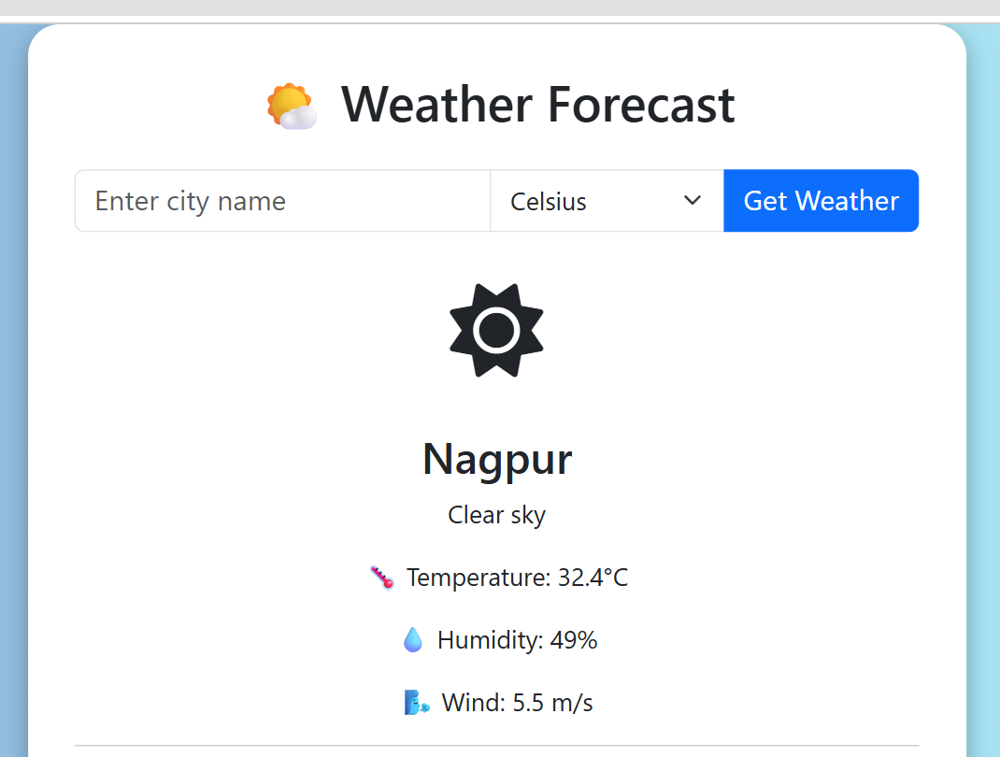

# OIBSIP Python Task 1 – Weather App

## 🌦 Objective
Create a weather application that shows real-time weather data based on user input city using OpenWeatherMap API.

## 🧾 Steps Performed
1. Created Django project with weather app
2. Integrated OpenWeatherMap API
3. Designed simple UI for input and result
4. Parsed API response and displayed data

## 🛠️ Tools & Tech Used
- Python
- Django
- HTML, CSS
- OpenWeatherMap API

## ✅ Outcome
User enters a city name and receives current temperature, humidity, pressure, and weather condition.

## 📷 Screenshot

