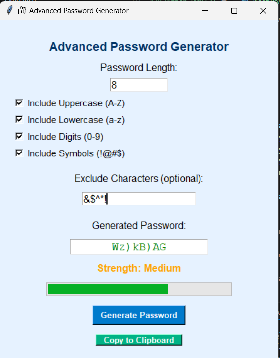

# 🔐 OIBSIP Python Task 3 – Advanced Password Generator

## 🎯 Objective
The objective of this project is to create an advanced password generator with a user-friendly GUI using Tkinter in Python. The application allows users to generate strong, customizable passwords and check their strength.

---

## 🧾 Steps Performed

1. Designed a responsive GUI using Tkinter.
2. Allowed user to input password length and choose character types:
   - Uppercase letters (A–Z)
   - Lowercase letters (a–z)
   - Digits (0–9)
   - Symbols (e.g., @, #, $)
3. Added option to exclude specific characters.
4. Generated passwords using Python’s `random` and `string` modules.
5. Checked password strength based on length and variety of characters.
6. Visualized password strength using a progress bar.
7. Enabled one-click copying of password to clipboard.
8. Added toast-like feedback for clipboard actions.

---

## 🛠️ Tools & Technologies Used

- Python 3
- Tkinter (for GUI)
- `string`, `random` (for password generation)
- `pyperclip` (for clipboard copy)
- ttk (for progress bar)

---

## ✅ Outcome

- Users can generate highly customizable passwords.
- Strength of password is indicated visually and textually.
- Passwords can be copied directly to clipboard.
- UI is clean, functional, and responsive.

---

## 📸 Screenshot

